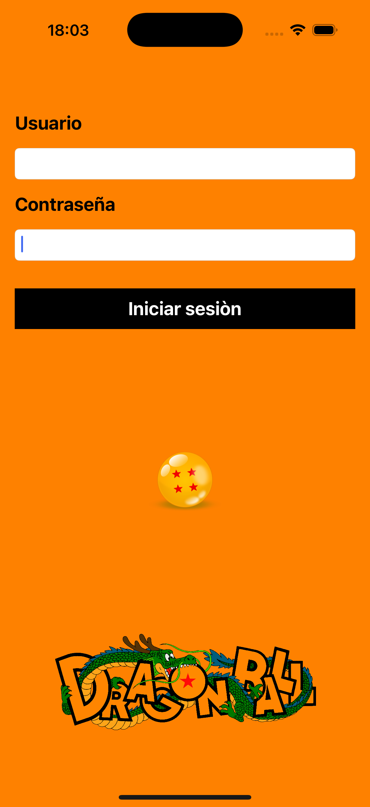
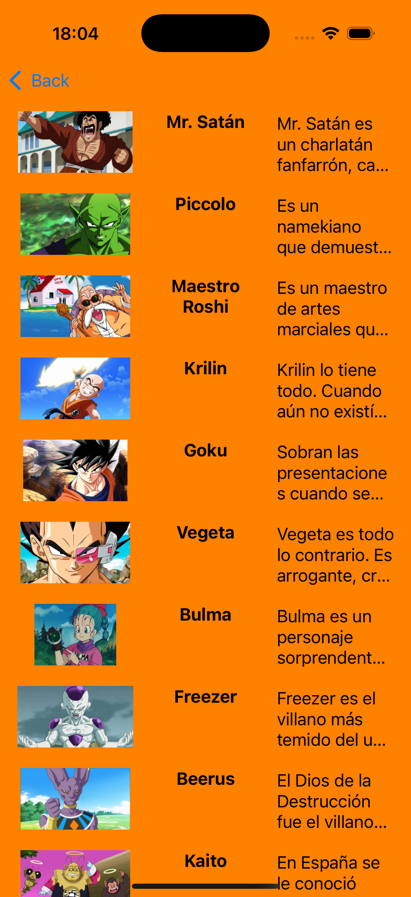
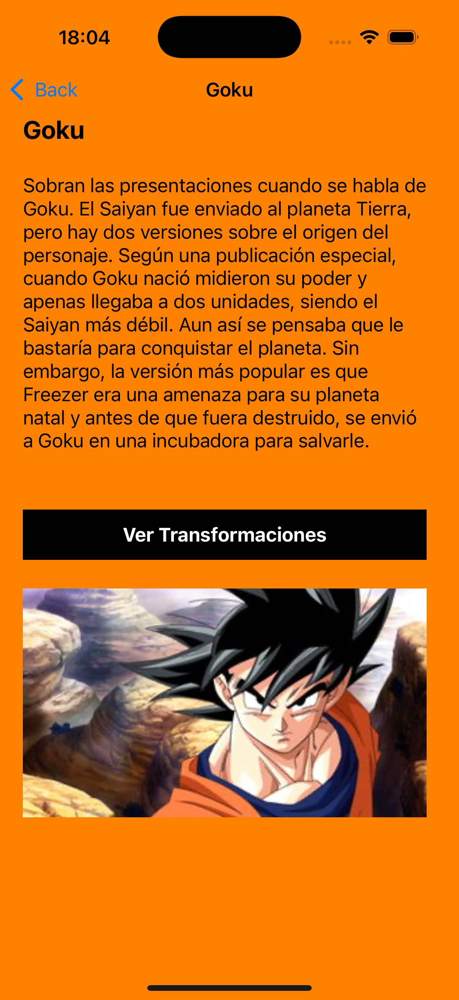
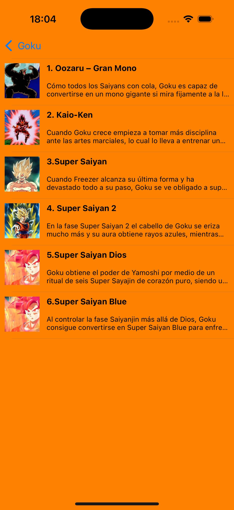
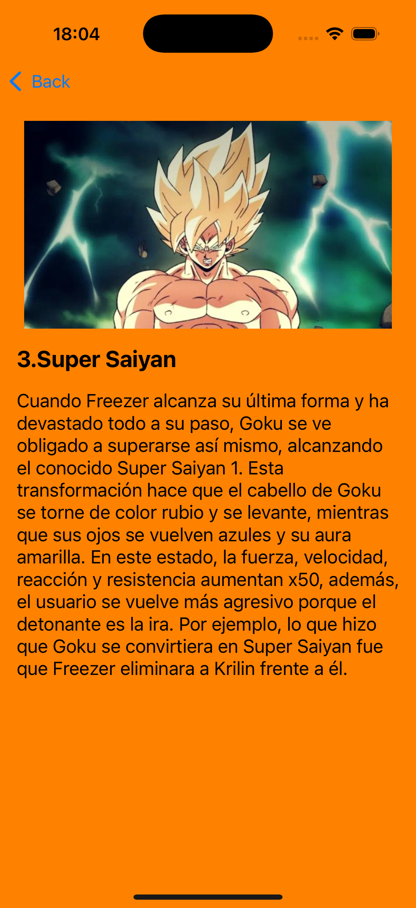

# DesignPatterns

Aplicación iOS desarrollada en Swift siguiendo el patrón **MVVM**. Consume la API de Dragon Ball para mostrar héroes y sus transformaciones.

---

## 🏗️ Arquitectura

- **MVVM**: Separación clara entre UI (ViewController), lógica de presentación (ViewModel) y modelos de dominio.

---

## 📱 Capturas de pantalla

### 1. Login


### 2. Lista de héroes


### 3. Detalle del héroe


### 4. Lista de transformaciones


### 5. Detalle de transformación


---

## 🚀 Características

- Login seguro contra la API.
- Listado de héroes con imágenes.
- Detalle de héroe con botón para ver transformaciones.
- Listado y detalle de transformaciones.
- Navegación fluida y UI adaptable.
- Manejo profesional de errores.
- Tests unitarios de lógica de negocio y presentación.

---

## 🧩 Estructura de carpetas

```
Domain/         # Modelos y UseCases
Data/           # DTOs, Mappers, DataSources, Requests
Networking/     # Lógica de red
Presentation/   # ViewModels, Controllers, Views
Components/     # Celdas y vistas reutilizables
Resources/      # Assets, Info.plist, Screenshots
Tests/          # Tests unitarios y mocks
```

---

## ▶️ Cómo ejecutar el proyecto

1. Clona este repositorio en tu máquina local.
2. Abre el archivo `DesignPatterns.xcodeproj` con Xcode.
3. Selecciona un simulador de iPhone y pulsa **Run** (o `⌘+R`).
4. En el login de la aplicación introduce tu usuario y contraseña válidos para la API de Dragon Ball.

> **Nota:** Si no dispones de usuario para la API, puedes iniciar sesión con:
> - **Usuario:** manololiebana@gmail.com
> - **Contraseña:** abcdef

---

## 🧪 Testing

- Ejecuta los tests con `Cmd+U` en Xcode.
- Cobertura en UseCases y ViewModels.
- Mocks para aislar la lógica (ver carpeta `DesignPatternsTests/Mocks`).
- Tests incluidos:
  - `GetHeroesUseCaseTests`
  - `GetTransformationsUseCaseTests`
  - `HeroListViewModelTests`
  - `LoginUseCaseTests`
  - `LoginViewModelTests`
  - `TransformationListViewModelTests`

---

## 👨‍💻 Autor

Desarrollado por **Manuel Liebana**.

--- 
